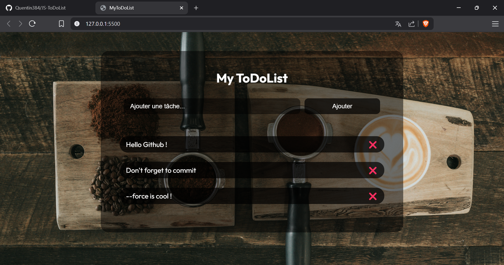

🎯 Objectif du projet

Développer une application ToDoList simple en JavaScript natif, sans persistance des données, afin de mettre en œuvre les principes de la programmation orientée objet (POO) dans un cadre HTML/CSS minimal.

👉 Pour essayer MyToDoList :
https://quentin384.github.io/JS-ToDoList/

---

🧠 Compétences visées

Maîtrise des bases de la POO en JavaScript

Structuration logique d’une application (modélisation, séparation des responsabilités)

Interaction dynamique avec le DOM

Initiation à la documentation technique

Communication technique sur les choix et la conception

---

⚙️ Contraintes techniques

Utilisation exclusive de JavaScript natif (pas de framework ou bibliothèque)

Projet sans base de données (non persistant)

Interface en HTML/CSS simple, fonctionnelle et accessible

---

📅 Déroulement du projet

Durée : 3 demi-journées

Travail en autonomie encadrée avec retours réguliers de l’encadrant

Démarche problème -> solution, avec un accent sur la réflexion avant l’implémentation

---

📈 Évaluation

Formative (pendant le projet) :
Pertinence de la modélisation orientée objet

Capacité à améliorer son code (refactoring, corrections)

Clarté dans l’explication des choix techniques

Sommative (à la fin) :
Fonctionnalité complète et fluide de la ToDoList

Qualité du code : lisibilité, structuration, respect des concepts POO

Présentation synthétique et claire (écrite ou orale)

---

📝 Livrables attendus

Code source complet : HTML / CSS / JavaScript

README incluant :

Description du projet

Organisation du code (classes, responsabilités)

Instructions de test

Support de présentation (facultatif selon modalité retenue) :

Démo orale

Slides simples (si nécessaire)

---

📌 Auteurs

👨‍💻 Réalisé par : Quentin – Étudiant développeur Fullstack Java / JS

📅 Projet individuel – avril 2025

